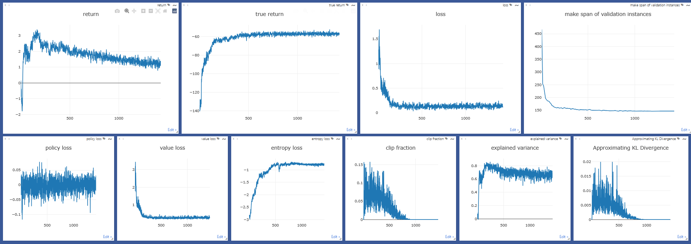

# Dynamic Graph Attention and GraphLSTM for Intelligent Scheduling in AGV- Integrated Flexible Job Shop

## Project Overview
A research implementation solving Flexible Job Shop Scheduling Problem with transportation constraints (FJSPT) using heterogeneous graph neural networks (GNN) and proximal policy optimization (PPO).

## Key Features
·An end-to-end integrated scheduling framework via graph-based reinforcement learning is proposed.  
·A heterogeneous graph fusion network with gated dynamic attention embedding is designed to extract multi-level interactions among operations, machines, and AGVs.  
·A GraphLSTM-driven module is incorporated into the node embedding layer to model the temporal and sequential dependencies intrinsic to flexible job shop scheduling.

## Project Structure
```
fjsp_gnn_drl_pyg/
├── agent/
│   └── ppo_agent.py               # PPO Agent implementation
├── config/                         # Configuration files
│   └── parse_args.py 
├── FJSP-benchmarks/              # FJSP benchmark instances
├── FJSP-layouts/                  # Workshop layout files
├── fjsp_env/
│   ├── fjsp_env.py               # Main FJSPT environment logic 
├── fjsp_lib/
│   ├── fjsp_graph_data.py        # Graph data structures generation
│   ├── fjsp_instance.py          # Problem instance definition
│   ├── fjsp_partial_solution.py    # Partial solution (recording scheduled information)
│   ├── generate_instance.py      # Instances generation
│   └── read_fjsp.py           # Benchmark instance reader (parsing FJSP benchmark files)
│   └── write_fjsp.py          # Problem instance writer (saving FJSP instances to files)
├── hgnn/
│   ├── hetero_gatv2_conv.py           # Heterogeneous Graph Attention layers
│   ├── hgnn.py                      # Main HGFN architecture
│   ├── machine_node_embedding.py     # Machine node embedding
│   ├── operation_node_embedding.py    # Operation node embedding
│   └── vehicle_node_embedding.py  # Vehicle node embedding
└── train_ppo.py                  # Main training script
```

## Prerequisites
- **Python**: 3.9.21  
- **PyTorch**: 2.5.0  
- **PyTorch Geometric**: 2.6.1  
- **Visdom**: 0.2.4  
- **NumPy**: 1.26.4  
- **Pandas**: 2.3.1 

## Network Architecture
The network architecture is shown in the figure below：


## Visdom
The visualization results obtained using Visdom are shown in the figure below：


## Supplementary MILP Model
To accurately characterize the FJSPT, we additionally formulate a MILP model, and its implementation is provided in the `FJSPT_MILP/` directory.

## Reference
https://github.com/songwenas12/fjsp-drl  
Paper: Flexible Job-Shop Scheduling via Graph Neural Network and Deep Reinforcement Learning, Wen song, Xinyang Chen, Qiqiang Li , and Zhiguang Cao doi: 10.1109/TII.2022.3189725.
